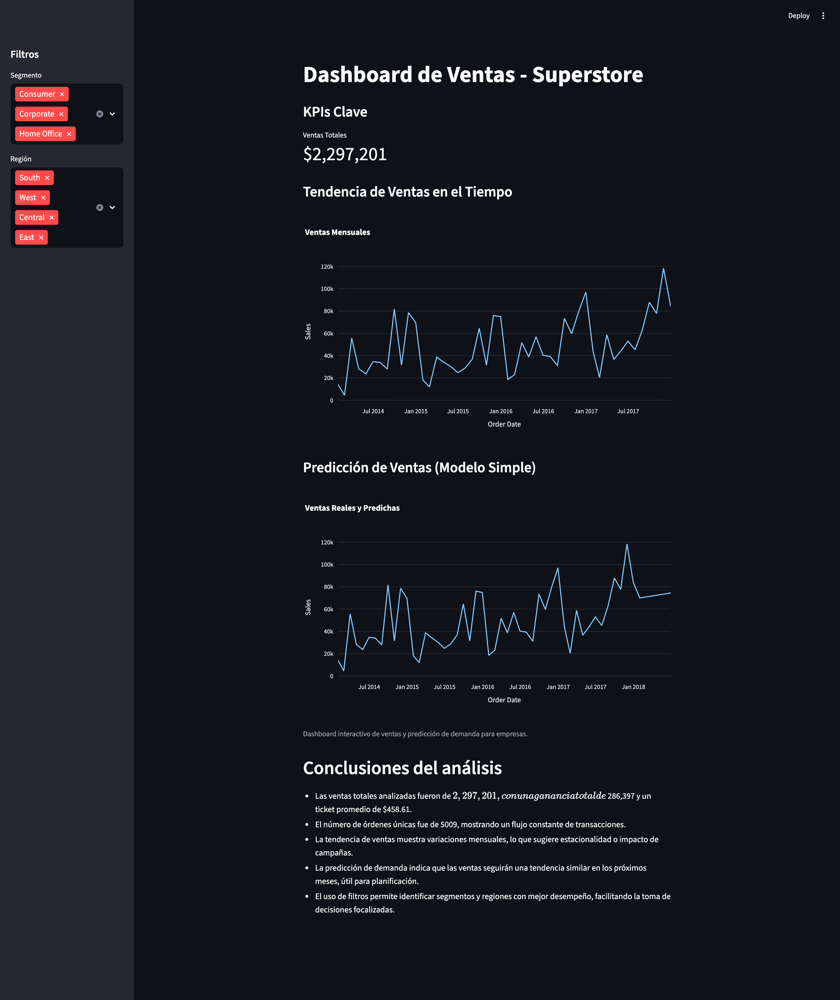

# Proyecto: Dashboard y Análisis de Ventas - Superstore

Este proyecto presenta un análisis integral de ventas utilizando el dataset Superstore, diseñado para demostrar capacidades analíticas y de visualización de datos a empresas interesadas en optimizar su gestión comercial.



## ¿Qué hace este proyecto?

- **Análisis Exploratorio de Datos (EDA):** Limpia y transforma los datos de ventas, identificando patrones clave, segmentos de clientes, productos más rentables y regiones con mejor desempeño.
- **Dashboards Interactivos:** Permite a los usuarios explorar visualmente tendencias de ventas, KPIs relevantes (ingresos, margen, volumen de ventas), y realizar comparativas entre categorías, segmentos y periodos de tiempo.
- **Predicción de Demanda:** Incluye modelos básicos de predicción para anticipar la demanda futura, facilitando la toma de decisiones estratégicas.
- **Identificación de Oportunidades:** Detecta áreas de mejora y oportunidades de crecimiento a partir de los datos históricos.

## Resultados principales

- **Visualización clara de tendencias:** Gráficas interactivas muestran el comportamiento de ventas por región, categoría y segmento de clientes.
- **KPIs clave al alcance:** Paneles con métricas como ingresos totales, margen de beneficio, ticket promedio y productos estrella.
- **Insights accionables:** Recomendaciones basadas en los hallazgos del análisis, como productos a potenciar, regiones con potencial de crecimiento y segmentos de clientes prioritarios.
- **Predicción de ventas:** Estimaciones de demanda futura para mejorar la planificación y gestión de inventario.

## Estructura del proyecto

- `dashboards/`: Dashboards interactivos (Streamlit)
- `data/`: Datos originales y limpios
- `figures/`: Gráficas generadas por el EDA
- `requirements.txt`: Dependencias del proyecto

## Ejecución rápida

1. Instala dependencias:

    ```sh
    pip install -r requirements.txt
    ```

2. Coloca el archivo `superstore.csv` en la carpeta `data/`.
3. Ejecuta el EDA:

    ```sh
    python scripts/eda_superstore.py
    ```

4. Visualiza las gráficas con el dashboard:

    ```sh
    streamlit run dashboards/eda_dashboard.py
    ```

5. Ejecuta el dashboard principal de ventas:

    ```sh
    streamlit run dashboards/dashboard_superstore.py
    ```

---

Este proyecto está listo para ser presentado a equipos directivos o comerciales, facilitando la toma de decisiones basadas en datos y la identificación de oportunidades de negocio.
